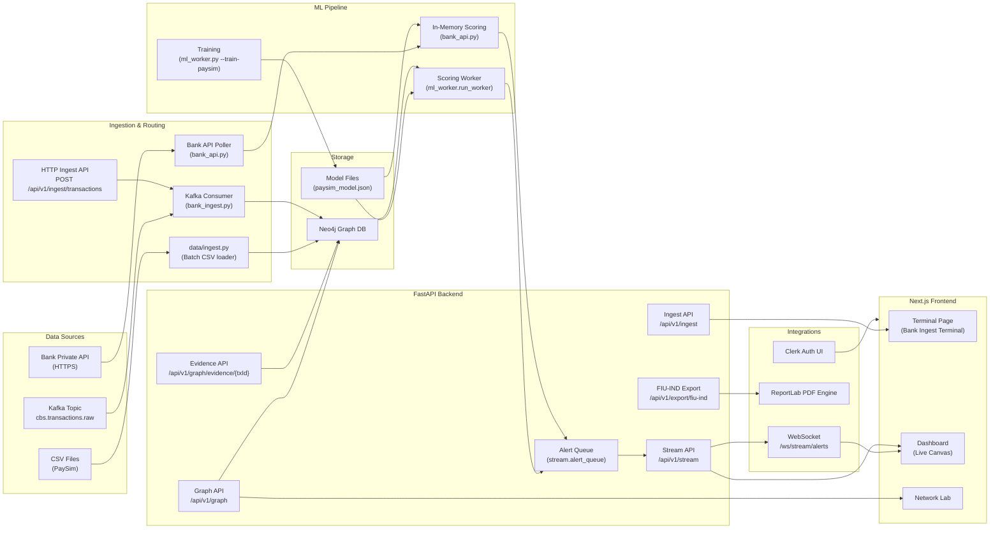

# FundTrace AI — Architecture Diagram

## System overview (scanned codebase)

## Components (labeled)

### Data sources
- **CSV Files** (`data/ingest.py`): PaySim CSVs for batch ingestion.
- **Kafka Topic** (`bank_ingest.py`): `cbs.transactions.raw` (enabled with `KAFKA_ENABLED=true`).
- **Bank Private API** (`bank_api.py`): HTTPS polling with auth headers/token.

### Ingestion & routing
- **CSV Ingest**: Builds Transaction nodes + relationships in Neo4j.
- **Kafka Consumer**: Maps Kafka events to Neo4j and backfills edges; gated by `KAFKA_ENABLED`.
- **HTTP Ingest API**: `POST /api/v1/ingest/transactions` (Neo4j-backed).
- **Bank API Poller**: Pulls batches, scores in memory, and streams alerts **without persisting**.

### Storage & model artifacts
- **Neo4j Graph DB**: Source of truth for graph exploration + evidence.
- **Model Store**: `data/paysim_model.json`.

### ML pipeline
- **Training** (`ml_worker.py`): XGBoost for PaySim dataset.
- **Scoring Worker** (`run_worker`): Pulls unscored Neo4j nodes, scores, updates risk, emits alerts.
- **In‑Memory Scoring** (`bank_api.py`): Scores bank API batches without persistence.

### Backend APIs
- **Graph API**: `/api/v1/graph/*` for graph focus, clusters, stats.
- **Evidence API**: `/api/v1/graph/evidence/{txId}` for evidence packages.
- **Export API**: `/api/v1/export/fiu-ind` with luxury-styled ReportLab PDF.
- **Stream API**: `/api/v1/stream/alerts` WebSocket broadcasting alerts.
- **Ingest API**: `/api/v1/ingest/*` for Kafka/HTTP ingest and bank API status/fetch.

### Frontend
- **Terminal Page**: Bank ingest telemetry + manual batch pull.
- **Dashboard**: Live alert stream + 3D graph + evidence panel.
- **Network Lab**: Transaction search and fraud clusters.

### Integrations
- **WebSocket**: Live alert stream to frontend.
- **ReportLab**: PDF generation for FIU‑IND exports.
- **Clerk**: Auth UI (front-end integration).

## Key technical choices (and why)
1. **Neo4j for graph storage**: optimized for path/relationship queries in fraud chains.
2. **XGBoost models**: efficient, explainable classification for tabular fraud features.
3. **Async FastAPI + thread pool**: keeps Neo4j I/O from blocking the event loop.
4. **Dual ingestion modes**:
   - **Kafka/HTTP → Neo4j** for persistent analytics and graph queries.
   - **Bank API → In-Memory** for privacy-sensitive deployments (no storage).
5. **WebSocket alerts**: low-latency streaming into the dashboard.
6. **ReportLab PDFs**: deterministic, styled compliance reports in code.

## Gen‑AI / LLM details
- **LLM**: **None** (no LLMs in the codebase).
- **Prompting approach**: **N/A**.
- **RAG pipeline**: **None**.

## Security & governance notes
- **Ingestion gating**: `KAFKA_ENABLED` and `BANK_API_ENABLED` must be true to activate each pipeline.
- **Bank API auth**: configurable header + token; SSL verification is configurable.
- **Audit/logging**: export and graph actions use audit logging hooks.
- **Rate limiting**: PDF export endpoint is rate limited.
